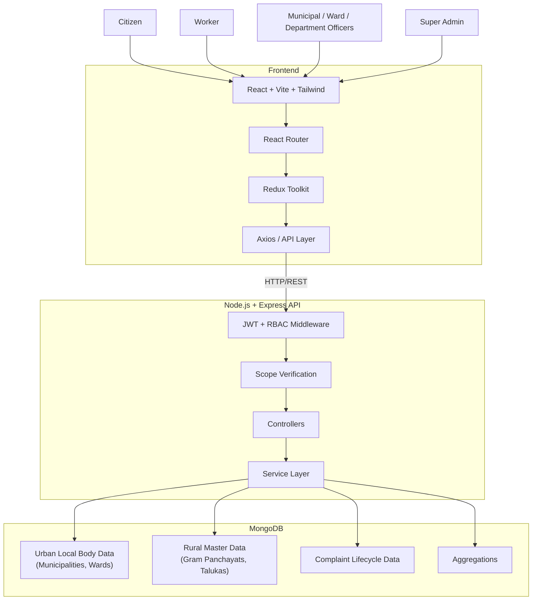
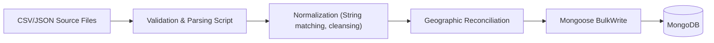
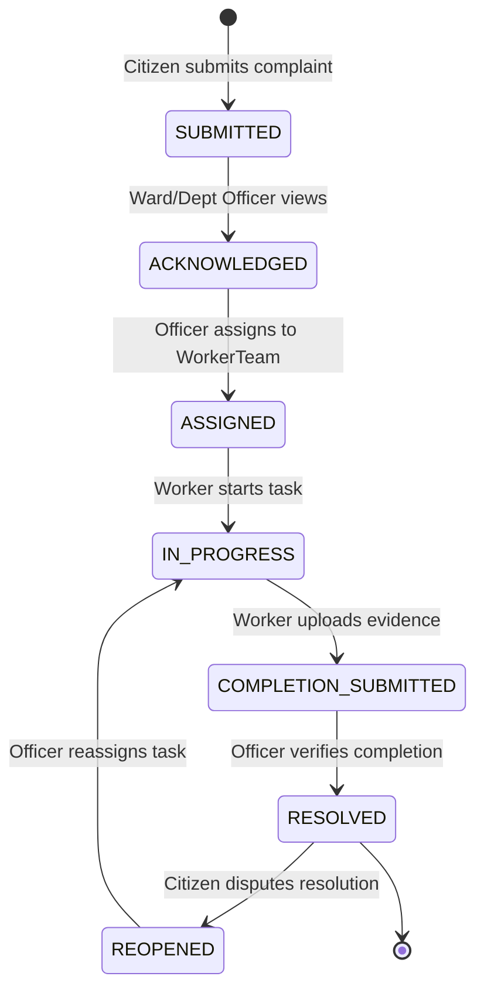
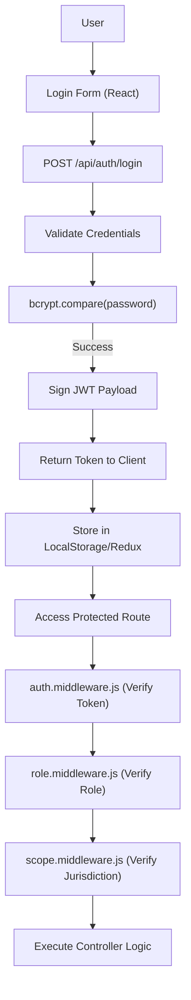
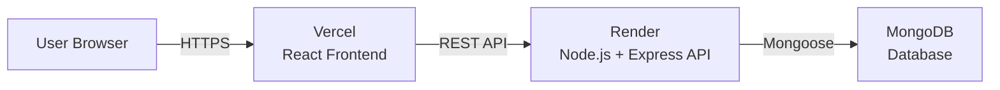

# Smart Municipal Management Platform

<div align="left">
  
  
  
  
  
  
  
  
  
  
  
  
  
  
  
  
  
  
  
  
  
  
  
  
  
</div>
> A comprehensive, role-based e-Governance platform designed to digitize and streamline municipal operations across Maharashtra.
> 
> **The Problem:** Traditional municipal administration suffers from fragmented communication, lack of structured data, delayed grievance redressal, and zero visibility into workforce accountability. Managing geographically distinct urban local bodies (Municipalities) and massive rural networks (Gram Panchayats) on a single platform is historically error-prone due to data inconsistencies.
> 
> **The Solution:** The Smart Municipal Management Platform bridges this gap by offering a centralized, highly secure (JWT + RBAC) system. It features automated SLA-based complaint escalation, real-time analytics dashboards for stakeholders, and a meticulously reconciled geographic database covering 395+ Urban Local Bodies and 28,000+ Gram Panchayats. By enforcing strict data integrity using Local Government Directory (LGD) codes, the platform ensures that citizens, ward officers, and super admins can seamlessly interact, track issues, and manage civic infrastructure with 100% transparency.

## Live Demo

| Component | Platform | URL |
| :--- | :--- | :--- |
| Frontend | Vercel | TBD — add deployed Vercel URL |
| Backend API | Render | TBD — add deployed Render URL |
| Database | MongoDB | Configured via environment variables — URL intentionally not published |

---

## Documentation Status
This README documents the current implementation state of the Smart Municipal Management Platform. It is intentionally maintained as a living document and will be updated as additional modules, deployments, integrations, testing, and production hardening are completed.

- **Current documentation version**: v1.0
- **Current project stage**: Phase 13 Complete (Post-Reconciliation Integrity Audit)
- **Last Updated**: 2026-09-22

---

## Table of Contents

- [Executive Project Overview](#executive-project-overview)
- [Problem Statement](#problem-statement)
- [Proposed Solution](#proposed-solution)
- [Key Features](#key-features)
- [User Roles](#user-roles)
- [RBAC Architecture](#rbac-architecture)
- [System Architecture](#system-architecture)
- [System Architecture Explanation](#system-architecture-explanation)
- [Tech Stack](#tech-stack)
- [Database Architecture](#database-architecture)
- [Urban and Rural Local-Body Separation](#urban-and-rural-local-body-separation)
- [Maharashtra Administrative Geography](#maharashtra-administrative-geography)
- [Data Sources & References](#data-sources--references)
- [Data Ingestion Architecture](#data-ingestion-architecture)
- [LGD Code Architecture](#lgd-code-architecture)
- [Gram Panchayat Reconciliation](#gram-panchayat-reconciliation)
- [Complaint Lifecycle](#complaint-lifecycle)
- [SLA Architecture](#sla-architecture)
- [Duplicate Complaint Detection](#duplicate-complaint-detection)
- [Analytics](#analytics)
- [Dashboards](#dashboards)
- [API Documentation](#api-documentation)
- [API Pagination](#api-pagination)
- [Security Architecture](#security-architecture)
- [Security Testing](#security-testing)
- [Environment Variables](#environment-variables)
- [Database](#database)
- [Local Development Setup](#local-development-setup)
- [Deployment](#deployment)
- [Vercel Deployment Guide](#vercel-deployment-guide)
- [Render Deployment Guide](#render-deployment-guide)
- [Project Directory Structure](#project-directory-structure)
- [Design / UI Documentation](#design--ui-documentation)
- [Workflow Diagrams](#workflow-diagrams)
- [Authentication Flow](#authentication-flow)
- [Deployment Architecture Diagram](#deployment-architecture-diagram)
- [Development Phases](#development-phases)
- [Current Project Status](#current-project-status)
- [Known Limitations](#known-limitations)
- [Future Enhancements](#future-enhancements)
- [Testing Strategy](#testing-strategy)
- [Performance](#performance)
- [Data Integrity](#data-integrity)
- [Development Guidelines](#development-guidelines)
- [Security Notice](#security-notice)
- [Data Source Disclaimer](#data-source-disclaimer)
- [License](#license)
- [Acknowledgements](#acknowledgements)
- [Screenshots](#screenshots)
- [Demo](#demo)
- [API Examples](#api-examples)

---

## Executive Project Overview

The **Smart Municipal Management Platform** is a scalable, modern MERN-stack application designed to address the complex logistical and operational challenges faced by municipal bodies in India. It serves as a unified digital ecosystem connecting citizens, field workers, municipal administrators, and state-level oversight authorities.

By centralizing the complaint lifecycle, the platform allows **Citizens** to intuitively report and track civic issues, while enabling **Ward and Department Officers** to seamlessly assign, monitor, and enforce Service Level Agreements (SLAs) for these reports. **Field Workers** utilize a dedicated interface to execute tasks, upload evidence, and mark resolutions.

Crucially, the platform manages the intricate geographic hierarchy of Maharashtra, supporting both **Urban Local Bodies** (Municipal Corporations, Councils, Nagar Panchayats) and **Rural Local Bodies** (Gram Panchayats) across Divisions, Districts, and Talukas. To maintain data integrity and strict access control, rural and urban management are cleanly segregated architecturally, ensuring that local administrators only access operations within their jurisdiction while providing **Super Admins** with a statewide master-data oversight view.

---

## Problem Statement

Managing municipal operations across a vast state like Maharashtra is fraught with operational bottlenecks. The sheer scale and complexity of the administrative hierarchy create significant hurdles for efficient governance and service delivery.

Key practical municipal-management problems include:

1.  **Complaint Fragmentation:** Civic complaints are often scattered across multiple disjointed systems, emails, phone calls, or manual paper trails. There is no single source of truth for the status of an issue.
2.  **Lack of Centralized Complaint Tracking:** Without a unified system, citizens cannot easily track the progress of their complaints, leading to frustration and repeated follow-ups.
3.  **Manual Assignment:** Assigning tasks to field workers is often a manual, ad-hoc process reliant on phone calls or physical ledgers, making it prone to errors, delays, and unequal workload distribution.
4.  **Unclear Ownership:** When a complaint spans multiple jurisdictions or departments, it frequently falls through the cracks due to ambiguous responsibility.
5.  **Poor SLA Visibility:** Service Level Agreements (SLAs) are rarely tracked systematically. There is no automated mechanism to highlight overdue tasks or escalate them to higher authorities, resulting in prolonged service outages.
6.  **Weak Field-Worker Coordination:** Coordinating hundreds of field workers without real-time tracking means supervisors cannot effectively verify task completion or reassign resources dynamically.
7.  **Lack of Escalation Visibility:** Higher-level administrators lack visibility into bottlenecks at the ward or department level.
8.  **Limited Analytics:** Without digitized workflows, generating actionable insights regarding common complaint categories, underperforming wards, or resource allocation is nearly impossible.
9.  **Inconsistent Geographic Organization:** Managing the complex hierarchy of Maharashtra (Divisions, Districts, Talukas, Wards, Areas) requires a robust data model. Inconsistent naming and structuring lead to data silos.
10. **Rural vs Urban Local-Body Differences:** Urban local bodies (Municipalities) have vastly different administrative structures and operational needs compared to rural local bodies (Gram Panchayats). Forcing both into a single architectural model inevitably causes friction and data contamination.
11. **Unauthorized Access Risks:** A lack of strict Role-Based Access Control (RBAC) and jurisdictional scoping allows users to inadvertently or maliciously access or modify records outside their purview (e.g., a Ward Officer modifying data in a different Ward).

---

## Proposed Solution

The Smart Municipal Management Platform addresses these systemic issues through a highly structured, role-based architecture.

| Problem | Platform Solution |
| :--- | :--- |
| **Complaint fragmentation** | Centralized complaint workflow tracking the entire lifecycle from submission to resolution in a unified database. |
| **Manual assignment** | Role-based assignment workflow allowing officers to efficiently dispatch tasks to specific worker teams based on load and location. |
| **SLA uncertainty** | Automated SLA tracking and due-date monitoring, highlighting overdue tasks and facilitating escalations. |
| **Poor visibility** | Dedicated, role-specific dashboards and geographic analytics providing real-time insights to all levels of administration. |
| **Geographic complexity** | Accurate digital representation of the Maharashtra administrative hierarchy, utilizing LGD codes for standardization. |
| **Rural/urban mixing** | Separate rural and urban local-body architecture, ensuring master data integrity and distinct access controls for Gram Panchayats vs. Municipalities. |
| **Unauthorized access** | Robust JWT authentication combined with strict RBAC and jurisdictional scope middleware to prevent IDOR and unauthorized data manipulation. |

---

## Key Features

The platform provides a comprehensive suite of tools tailored to specific user roles, ensuring efficient operations across the entire municipal hierarchy.

### Citizen
- **Complaint Submission:** Intuitive interface for reporting civic issues with category selection and precise location details.
- **Complaint Tracking:** Real-time visibility into the status of submitted complaints.
- **Complaint Timeline:** Visual representation of the complaint's lifecycle events (Acknowledged, Assigned, In Progress, Resolved).
- **Reopen Workflow:** Ability to reopen a resolved complaint if the issue persists or the resolution is unsatisfactory.
- **Status Visibility:** Transparent access to officer comments and worker evidence photos.

### Worker
- **Assigned Work:** Clear, prioritized list of tasks assigned to the worker's team.
- **Active Tasks:** Status toggles to indicate when work has actively commenced.
- **Start Work:** Mechanism to explicitly log the commencement of a task, starting the resolution SLA timer.
- **Completion Submission:** Interface for uploading photographic evidence and submitting task completion reports.
- **Workload:** Visibility into personal and team task queues.

### Ward Officer
- **Ward-Level Complaint Monitoring:** Unified view of all complaints registered within the officer's assigned ward.
- **Workload Management:** Tools for balancing task assignments across available worker teams within the ward.
- **SLA Enforcement:** Dashboards highlighting upcoming SLA deadlines and overdue complaints requiring immediate intervention.
- **Area Analytics:** Geographic breakdown of issues within specific areas of the ward.
- **Reopened/Escalated Complaints:** Distinct queues for managing citizen disputes and escalated issues.

### Department Officer
- **Department Complaints:** Focused view of complaints relevant to the officer's specific department (e.g., Water Supply, Solid Waste Management) across the municipality.
- **Worker/Team Workload:** Visibility into the capacity and current assignments of department-specific worker teams.
- **Category Analytics:** Breakdown of common issues within the department's purview.
- **Completion Verification:** Reviewing worker evidence and formally marking tasks as resolved.

### Municipal Admin
- **Municipality Overview:** High-level dashboard aggregating data across all wards and departments within the municipality.
- **Ward Workload:** Comparative analysis of complaint volume and resolution rates across different wards.
- **Department Workload:** Tracking performance and resource utilization across municipal departments.
- **SLA Monitoring:** Municipality-wide visibility into SLA compliance and systemic bottlenecks.

### Super Admin
- **Global Overview:** Statewide dashboard aggregating data across all municipalities and districts.
- **Maharashtra Geography:** Comprehensive management of Divisions, Districts, and Talukas.
- **Local-Body Master Data:** Oversight and synchronization of Urban Local Bodies and Rural Gram Panchayats based on LGD standards.
- **User/Access Management:** Global provisioning and management of administrative accounts and access scopes.
- **System Structure:** Configuration of core platform parameters and master datasets.

---

## User Roles

The platform enforces strict Role-Based Access Control (RBAC) to ensure users only interact with data relevant to their jurisdictional scope and responsibilities.

| Role | Scope | Main Responsibilities |
| :--- | :--- | :--- |
| **CITIZEN** | Personal | Report civic issues, track complaint status, and interact with the resolution workflow for their own submissions. |
| **WORKER** | Assigned work | Execute field tasks assigned to their team, upload photographic evidence, and update task statuses. |
| **INSPECTOR** | Assigned geography | Inspect and verify completed civic work within their designated area before final resolution. |
| **WARD_OFFICER** | Municipality + Ward | Monitor ward complaints, manage ward field teams, assign tasks, and enforce SLAs within their specific ward. |
| **DEPARTMENT_OFFICER** | Municipality + Department | Monitor department complaints, manage department workload, and verify resolutions within their specific municipal department. |
| **MUNICIPAL_ADMIN** | Municipality | Oversee all operations within a specific municipality, manage officers, and track aggregate analytics across wards and departments. |
| **SUPER_ADMIN** | Global / Statewide | Manage global system structure, Maharashtra geographic master data (Divisions, Districts, Talukas, Gram Panchayats), and oversee all users. |

---

## RBAC Architecture

The platform's security relies on a deeply integrated, multi-layered Role-Based Access Control (RBAC) and scoping architecture.

1.  **JWT Authentication:** All authenticated requests must include a valid JSON Web Token (JWT) in the `Authorization` header. The token payload contains the user's ID, role, and hierarchical jurisdiction identifiers (`municipalityId`, `wardId`, `departmentId`).
2.  **Role Authorization (`role.middleware.js`):** This middleware intercepts requests and verifies that the authenticated user possesses the required role (e.g., `MUNICIPAL_ADMIN`, `WARD_OFFICER`) to access the specific endpoint.
3.  **Scope Middleware (`scope.middleware.js`):** This is the critical layer preventing Insecure Direct Object Reference (IDOR). It dynamically inspects the request parameters (e.g., `req.params.municipalityId`) or body payloads and compares them against the user's JWT payload.
    *   A `MUNICIPAL_ADMIN` attempting to update a Ward that does not belong to their assigned `municipalityId` will be immediately blocked with a 403 Forbidden error.
    *   A `WARD_OFFICER` can only assign complaints located within their assigned `wardId`.
4.  **Backend Enforcement:** Authorization is enforced strictly on the backend API, not just hidden in the frontend UI.

**IMPORTANT: Gram Panchayat Restrictions**
The architectural decision was made to strictly restrict Gram Panchayat management to the `SUPER_ADMIN` role. A `MUNICIPAL_ADMIN` is designed to oversee a specific Urban Local Body (Municipality) and must not have statewide access to rural master data. Rural Gram Panchayat data is kept entirely separate from urban municipal administration to prevent data contamination and adhere to the distinct administrative hierarchies governing rural and urban areas in Maharashtra.

---

## System Architecture



---

## System Architecture Explanation

-   **Client (Frontend):** The user interface is built using React, providing a dynamic and responsive Single Page Application (SPA) experience. It leverages Vite for rapid development and optimized production builds, and Tailwind CSS for utility-first, consistent styling across all components.
-   **Routing:** React Router manages navigation within the SPA. It incorporates `ProtectedRoute` and `RoleRoute` wrappers to prevent unauthorized users from accessing specific dashboard views based on their authenticated role.
-   **State Management:** Redux Toolkit handles the global application state, managing authentication sessions, UI toggles (e.g., sidebars, modals), and caching frequently accessed data like analytics overviews to improve perceived performance.
-   **API Communication:** An Axios instance is configured to intercept all outgoing requests and automatically attach the user's JWT to the `Authorization` header, centralizing authentication logic.
-   **Authentication & Authorization:** Express middleware intercepts incoming API requests, validates the JWT, and enforces the RBAC and jurisdictional scoping rules defined for each endpoint before allowing the request to proceed.
-   **Controllers:** The presentation logic for the API. Controllers parse incoming HTTP requests, validate request bodies and parameters, delegate business logic to the Service layer, and format the final HTTP response.
-   **Services:** The core business logic layer. Services encapsulate complex operations, such as SLA calculations, complaint state transitions, geographic reconciliation, and complex database aggregations, keeping Controllers lean and testable.
-   **Database:** MongoDB serves as the NoSQL persistent data store. Mongoose acts as the Object Data Modeling (ODM) library, enforcing strict schema definitions, validation rules, unique constraints, and managing relationships between documents.
-   **External Data Sources:** The platform utilizes structural data from the Government of India's Local Government Directory (LGD) to accurately model the complex administrative hierarchy of Maharashtra.

---

## Tech Stack

| Layer | Technology | Purpose |
| :--- | :--- | :--- |
| **Frontend** | React (v19) | Component-based UI library |
| **Build** | Vite | Ultra-fast frontend build tooling |
| **Styling** | Tailwind CSS | Utility-first CSS styling |
| **Routing** | React Router | Declarative SPA navigation |
| **State** | Redux Toolkit | Predictable application state |
| **HTTP** | Axios | Promise-based API communication |
| **Charts** | Recharts | Composable analytics visualization |
| **Backend** | Node.js (v22+) | Asynchronous JavaScript runtime |
| **API** | Express.js | Minimalist REST API framework |
| **Database** | MongoDB | Persistent document storage |
| **ODM** | Mongoose | Data modeling and schema validation |
| **Authentication**| JWT | Stateless user authentication |
| **Security** | bcryptjs | Secure password hashing |

---

## Database Architecture

The data architecture relies on distinct collections mapped via robust Mongoose schemas.

| Model | Purpose |
| :--- | :--- |
| **User** | Authentication credentials (hashed password), core identity, role, and hierarchical scopes (`municipalityId`, `wardId`, etc.). |
| **Municipality** | Urban local bodies (Municipal Corporations, Councils, Nagar Panchayats), including LGD codes. |
| **Ward** | Administrative subdivisions within a specific Municipality. |
| **Area** | Hyper-local geographic markers within Wards to aid in precise complaint location routing. |
| **Department** | Operational municipal departments (e.g., Solid Waste Management, Water Supply). |
| **Designation** | Standardized employee job titles within departments. |
| **Employee** | Employment records linked to a User, specifying their Department and Designation. |
| **WorkerTeam** | Grouping of field workers for task assignment and workload balancing. |
| **Complaint** | Core complaint details (citizen ID, location, category, priority), current status, and SLA tracking fields. |
| **ComplaintUpdate**| Immutable ledger of all status transitions and officer comments, providing a full audit trail. |
| **Division** | Top-level Maharashtra administrative geography (e.g., Konkan Division). |
| **District** | Sub-divisions within Divisions (e.g., Pune District). |
| **Taluka** | Rural sub-districts within Districts. |
| **GramPanchayat** | Rural local-body master data, explicitly separated from Urban Municipalities. |

### Relationships
- A `Complaint` references a `Citizen` (User), a `Municipality`, a `Ward`, and optionally an `Area` and `WorkerTeam`.
- A `WorkerTeam` references a `Municipality`, `Ward`, `Department`, and multiple `Employee` records.
- `GramPanchayat` records strictly reference `Taluka`, which references `District`, which references `Division`.

---

## Urban and Rural Local-Body Separation

To prevent data contamination and enforce strict jurisdictional boundaries, the system explicitly separates Urban and Rural architecture at the schema level.

### Urban Architecture (Operational Workflow)
**Hierarchy:** `State` → `District` → **`Municipality`** → `Ward` → `Area`
Municipalities are the core operational units for the platform's complaint lifecycle. They contain their own Wards, Departments, Areas, and active Complaint workflows. A `MUNICIPAL_ADMIN` is scoped entirely to their specific `Municipality` document and cannot access data from other municipalities or rural areas.

### Rural Architecture (Master Data)
**Hierarchy:** `State` → `Division` → `District` → **`Taluka`** → **`Gram Panchayat`**
Gram Panchayats are tracked as statewide master data, reflecting the distinct administrative reality of rural Maharashtra. They are structurally distinct from Municipalities. **There is no generic "LocalBody" model.** Conflating a massive Municipal Corporation with a tiny Gram Panchayat into a single collection would severely degrade indexing performance, complicate API security boundaries, and require numerous nullable fields. The explicit separation ensures optimized querying and ironclad RBAC enforcement.

---

## Maharashtra Administrative Geography

The platform implements a highly accurate geographic hierarchy for the State of Maharashtra, sourced from official directories:

- **6 Divisions** (Konkan, Pune, Nashik, Aurangabad, Amravati, Nagpur)
- **36 Districts**
- **350+ Talukas**
- **395 Urban Municipalities** (Municipal Corporations, Municipal Councils, Nagar Panchayats)
- **28,087 Gram Panchayats** (Rural Local Bodies)

*Note: The exact counts of rural and urban local bodies are sourced directly from external integration scripts and represent the imported state of the system snapshot. These numbers may fluctuate as government classifications change.*

---

## Data Sources & References

The platform leverages standardized government data to ensure accuracy and interoperability.

- **Government Open Data Platform India**: [https://www.data.gov.in/](https://www.data.gov.in/)
- **Local Government Directory — Government of India**: [https://lgdirectory.gov.in/welcome.do](https://lgdirectory.gov.in/welcome.do)

**Data Source Disclaimer**:
The Local Government Directory (LGD) is used strictly as an external reference for standardized local-government and geographic master data. The official LGD website describes LGD as a unified directory covering states, rural, and urban local governments, with LGD codes utilized as standard location identifiers for e-governance interoperability.

*The Smart Municipal Management Platform utilizes this open data for geographic accuracy and architectural structuring. The project is not an official LGD integration partner, does not claim official government ownership, and is not a government product.*

---

## Data Ingestion Architecture



The platform includes robust Node.js ingestion scripts designed to process large datasets (like the 28,000+ Gram Panchayats) efficiently.
- **Source:** Data is typically read from CSV or JSON files sourced from data.gov.in or LGD.
- **Validation:** Scripts use `csv-parser` and custom logic to validate required fields (e.g., ensuring LGD codes are present).
- **Normalization:** Text fields are cleansed (trimming, case normalization) to facilitate matching.
- **Reconciliation:** Complex logic resolves textual names (e.g., a Taluka name from a CSV) to internal database ObjectIds based on parent relationships.
- **Bulk Import:** To ensure performance and idempotency, scripts heavily utilize MongoDB's `bulkWrite` operations (specifically `updateOne` with `upsert: true`). This prevents data duplication if scripts are run multiple times and ensures rapid database population.

---

## LGD Code Architecture

A critical architectural distinction is made between Official LGD codes and Internal Identifiers.

- **Official LGD Code:** This is the external identifier assigned by the Government of India (e.g., LGD Code `27` for Maharashtra, `272845` for a specific Gram Panchayat). It is stored in the database as `lgdCode` (String) and used for external integration, search, and referencing.
- **Internal Identifier:** This is the standard MongoDB `_id` (ObjectId) automatically generated by the database.

**Crucial Distinction:** Internal application logic, foreign keys, and relationships rely entirely on the MongoDB `_id`. The platform *must not* conflate these. If the government alters an LGD code structure, the internal relational integrity of the application remains intact. The platform does not generate "fake" LGD codes; if a record lacks an LGD code, the field remains null, and the internal ObjectId serves as the unique identifier.

---

## Gram Panchayat Reconciliation

The integration of 28,087 rural Gram Panchayats from LGD CSV data required complex mapping to internal `talukaId` structures. Because text-based names often mismatch due to spelling variations or formatting, a deterministic, multi-pass reconciliation script (`reconcile_talukas.js`) was utilized to resolve orphaned records.

**Verified Execution History:**
- 3974 Gram Panchayats initially unresolved.
- Pass 1 (Exact match after aggressive string cleansing): 180 mapped → 3794 remaining.
- Pass 2 (Fuzzy matching/alias resolution): 1766 mapped → 2028 remaining.
- Pass 3 (Secondary alias mapping): 1575 mapped → 453 remaining.
- Pass 4 (Manual override mapping): 453 mapped → 0 remaining.
- **Total: 3974 successfully processed.**

The reconciliation script successfully resolved the previously unresolved Taluka references based on deterministic mapping rules. A subsequent rigorous Phase 13 Integrity Audit validated the geographic consistency and completely purged BSON-type indexing duplicates (where LGD codes were mixed between Numbers and Strings), guaranteeing a 100% clean rural dataset.

---

## Complaint Lifecycle



**State Transitions and Permissions:**
- `SUBMITTED`: Initiated by `CITIZEN`.
- `ACKNOWLEDGED`: Updated by `WARD_OFFICER` or `DEPARTMENT_OFFICER`.
- `ASSIGNED`: Updated by `WARD_OFFICER` or `DEPARTMENT_OFFICER`.
- `IN_PROGRESS`: Updated by `WORKER`.
- `COMPLETION_SUBMITTED`: Updated by `WORKER` (requires evidence upload).
- `RESOLVED`: Verified and updated by `WARD_OFFICER` or `DEPARTMENT_OFFICER`.
- `REOPENED`: Initiated by `CITIZEN`.

---

## SLA Architecture

The platform enforces Service Level Agreements (SLAs) to guarantee timely civic resolutions. The SLA engine tracks various deadlines throughout the complaint lifecycle.

- **Acknowledgment Deadline:** Time limit for an officer to review a newly submitted complaint.
- **Resolution Due Date:** Calculated based on the complaint's Category and Priority.
- **Overdue Detection:** Automated flags highlight complaints that have breached their SLA deadlines.
- **Dashboard Monitoring:** Ward and Municipal Admins have dedicated UI components highlighting SLA compliance rates and critical overdue tasks requiring immediate escalation.

*Disclaimer: These SLA targets are application-defined configuration values used for workflow enforcement and demonstration purposes. They should not be interpreted as official government SLA standards or mandates.*

---

## Duplicate Complaint Detection

*Implemented — verification pending.*
The system includes logic to detect potential duplicate complaints submitted within a short timeframe for the same geographic area and category, presenting warnings to officers to prevent redundant field deployments.

---

## Analytics

The platform provides robust analytics capabilities, securely exposed via role-scoped API endpoints.

| Endpoint | Purpose | Scope |
| :--- | :--- | :--- |
| `/api/analytics/ward-overview` | Ward-level SLA compliance, complaint status breakdown, and category distribution. | `WARD_OFFICER` |
| `/api/analytics/municipality-overview`| Municipality-wide SLA trends, comparative ward performance, and department workload. | `MUNICIPAL_ADMIN` |
| `/api/analytics/global-overview` | Statewide adoption metrics, infrastructure totals (Municipalities vs GPs), and system health. | `SUPER_ADMIN` |

---

## Dashboards

The React frontend dynamically serves distinct dashboard layouts based on the authenticated user's role.

- **Super Admin Dashboard:** Focuses on statewide geographic master data management (Divisions, Districts, Talukas, Gram Panchayats) and global analytics.
- **Municipal Admin Dashboard:** Provides a high-level overview of the entire municipality, comparing ward performance, tracking department workloads, and monitoring overall SLA compliance.
- **Department Officer Dashboard:** Concentrates on complaints categorized under the officer's specific department, highlighting worker capacity and verifying task completions.
- **Ward Officer Dashboard:** Operates at the hyper-local level, mapping active complaints within the ward, managing field team deployments, and tracking critical overdue tasks.
- **Worker Dashboard:** (Mobile-optimized layout) Focuses purely on execution—listing active tasks assigned to the worker's team, providing start toggles, and forms for uploading completion evidence.
- **Citizen Dashboard:** A personal portal for submitting new complaints, viewing complaint history, tracking the visual timeline of active issues, and reopening unsatisfactory resolutions.

---

## API Documentation

The backend REST API is grouped by domain and protected by JWT authentication.

### Authentication
- `POST /api/auth/login` - Authenticate user and issue JWT. (Public)
- `GET /api/auth/me` - Retrieve current user profile. (Protected)

### Municipalities
- `GET /api/municipalities` - List all municipalities. (Public)
- `GET /api/municipalities/:id` - Get municipality details. (Public)

### Users / Roles
- `GET /api/users` - List users within scope. (`SUPER_ADMIN`, `MUNICIPAL_ADMIN`)
- `POST /api/users` - Provision new officer/worker account. (`SUPER_ADMIN`, `MUNICIPAL_ADMIN`)

### Complaints
- `POST /api/complaints` - Submit new complaint. (`CITIZEN`)
- `GET /api/complaints/my` - Get citizen's complaint history. (`CITIZEN`)
- `GET /api/complaints` - List complaints within scope. (Officers)
- `PATCH /api/complaints/:id/assign` - Assign worker team. (`WARD_OFFICER`, `DEPT_OFFICER`)
- `PATCH /api/complaints/:id/status` - Update complaint status. (Officers, Workers)

### Geography (Master Data)
- `GET /api/divisions` - List divisions. (`SUPER_ADMIN`)
- `GET /api/districts` - List districts. (`SUPER_ADMIN`)
- `GET /api/talukas` - List talukas. (`SUPER_ADMIN`)

### Gram Panchayats
- `GET /api/gram-panchayats` - Paginated rural lookup. (`SUPER_ADMIN`)

---

## API Pagination

The Gram Panchayat endpoint (`/api/gram-panchayats`) handles 28,000+ records. Returning this massive payload in a single response would crash the Node.js process and freeze the client browser.

Therefore, the system implements rigorous **server-side pagination**.
- **Parameters:** Supports `page`, `limit`, `districtId`, `talukaId`, `search` (name), and `lgdCode`.
- **Maximum Limit:** The backend strictly enforces a maximum `limit` (e.g., 100 records per page). If a client requests `limit=5000`, the backend automatically truncates it to 100 to prevent malicious pagination abuse and guarantee consistent API performance.
- **Frontend Integration:** The React frontend utilizes these pagination constraints to render manageable data tables, fetching new pages dynamically as the user navigates.

---

## Security Architecture

Security is baked into the platform at every layer.

- **JWT Authentication:** Stateless, tamper-proof JSON Web Tokens verify user identity on every request.
- **Password Hashing:** Passwords are never stored in plaintext; they are hashed using `bcryptjs` with a secure number of salt rounds.
- **Role-Based Access Control (RBAC):** Middleware (`role.middleware.js`) ensures users can only access routes permitted for their hierarchical role.
- **Scope-Based Authorization (Anti-IDOR):** The critical `scope.middleware.js` inspects request parameters and body payloads against the user's JWT scope. A `WARD_OFFICER` cannot modify complaints or assign teams in a different ward, preventing Insecure Direct Object Reference (IDOR) vulnerabilities.
- **Mass-Assignment Protection:** Update controllers are meticulously written to explicitly destructure and allow only specific fields. For example, a user update route might only accept `phone` and `address`, aggressively stripping out malicious attempts to inject `role="SUPER_ADMIN"` or alter `municipalityId`.
- **Pagination Abuse Protection:** Hard limits on `limit` queries prevent Denial of Service (DoS) via memory exhaustion.
- **Dependency-Safe Deletion:** Deleting structural master data (like a Ward or Department) is blocked by middleware if dependent records (like active Complaints or assigned WorkerTeams) exist, ensuring database referential integrity.
- **Environment Variables:** All secrets (Database URIs, JWT Secrets) are strictly loaded via `process.env` and excluded from version control.

---

## Security Testing

Rigorous security tests were executed during Phase 12 verification to validate the RBAC and scoping logic.

| Test | Result |
| :--- | :--- |
| Anonymous access to Gram Panchayat API | **PASS — 401 Unauthorized** |
| `CITIZEN` role access to GP API | **PASS — 403 Forbidden** |
| `MUNICIPAL_ADMIN` role access to GP API | **PASS — 403 Forbidden** |
| `SUPER_ADMIN` role access to GP API | **PASS — 200 OK** |
| Pagination abuse (Requesting Limit > 100) | **PASS — Safely truncated to 100** |
| Mass assignment (Attempting role injection) | **PASS — Malicious fields stripped** |

---

## Environment Variables

The system relies on securely configured `.env` files for local development and deployment environment variables for production.

**Example `server/.env` structure:**
```env
PORT=5000
NODE_ENV=development
MONGODB_URI=<your-mongodb-connection-string>
CLIENT_URL=<your-frontend-url>
JWT_SECRET=<your-jwt-secret>
JWT_EXPIRES_IN=1d
```

*Note: Never commit actual secret values to source control. Use the provided `.env.example` file as a template.*

---

## Database

**Database Technology: MongoDB**
The platform utilizes MongoDB as its persistent datastore, leveraging Mongoose for schema validation. MongoDB is uniquely suited for this platform due to its flexible document model, which accommodates the varying structures of different local bodies and complex nested geographic relationships.

*Credentials and connection URIs are supplied exclusively through environment variables. Connection URLs are intentionally not published in this documentation.*

---

## Local Development Setup

### Prerequisites
- Node.js (v22 or higher recommended based on package.json)
- npm (Node Package Manager)
- Git
- MongoDB database access (Local or Atlas, configured via `.env`)

### Setup Instructions

1. **Clone the Repository**
   ```bash
   git clone <repository-url>
   cd "Smart Municipal Management Platform"
   ```

2. **Install Frontend Dependencies**
   ```bash
   cd client
   npm install
   ```

3. **Install Backend Dependencies**
   ```bash
   cd ../server
   npm install
   ```

4. **Configure Environment Variables**
   - In the `server` directory, copy `.env.example` to `.env`.
   - Open `.env` and configure your `MONGODB_URI`, `JWT_SECRET`, and ensure `CLIENT_URL` points to your local React dev server (usually `http://localhost:5173`).

5. **Start Backend Server**
   ```bash
   # From the server directory
   npm run dev
   ```

6. **Start Frontend Server**
   ```bash
   # Open a new terminal, navigate to the client directory
   cd client
   npm run dev
   ```

---

## Deployment

The platform is designed for a decoupled deployment architecture, optimizing frontend delivery via Edge networks and backend processing via dedicated Node.js environments.

### Vercel Deployment Guide (Frontend)

1. **Create Vercel Project:** Log in to Vercel and import the Git repository.
2. **Configure Root Directory:** Set the Root Directory to `client`.
3. **Build Settings:**
   - Framework Preset: Vite (or manually set Build Command to `npm run build`)
   - Output Directory: `dist`
4. **Environment Variables:** Add `VITE_API_URL` and point it to your deployed Render backend API URL (e.g., `https://api.yourdomain.com`).
5. **Deploy:** Click Deploy and verify the frontend builds successfully.

### Render Deployment Guide (Backend API)

1. **Create Web Service:** Log in to Render and create a new Web Service connected to the Git repository.
2. **Configure Root Directory:** Set the Root Directory to `server`.
3. **Build & Start Commands:**
   - Build Command: `npm install`
   - Start Command: `npm start`
4. **Environment Variables:** Add all required secrets from your `.env` file:
   - `MONGODB_URI`
   - `JWT_SECRET`
   - `CLIENT_URL` (Point this to your deployed Vercel frontend URL to configure CORS properly).
   - `NODE_ENV=production`
5. **Deploy:** Click Deploy. Once live, verify connectivity by accessing the `/api/health` endpoint (if implemented) or observing the build logs.

---

## Project Directory Structure

```text
Smart Municipal Management Platform/
├── client/                     # React Frontend
│   ├── src/
│   │   ├── components/         # Reusable UI components
│   │   ├── constants/          # Static data and configuration
│   │   ├── pages/              # Role-specific views and layouts
│   │   ├── services/           # Axios API integration layer
│   │   ├── store/              # Redux Toolkit state slices
│   │   ├── App.jsx             # Root component and Routing setup
│   │   └── main.jsx            # Entry point
│   ├── package.json
│   ├── tailwind.config.js
│   └── vite.config.js
├── server/                     # Node.js + Express Backend
│   ├── src/
│   │   ├── constants/          # Application constants (e.g., SLAs)
│   │   ├── controllers/        # Request handling and response formatting
│   │   ├── data/               # Static geographic seed data
│   │   ├── middlewares/        # Auth, Role, and Scope verification
│   │   ├── models/             # Mongoose schemas (Urban, Rural, Complaints)
│   │   ├── routes/             # Express API route definitions
│   │   ├── scripts/            # Data ingestion and reconciliation tools
│   │   ├── services/           # Business logic and database interactions
│   │   └── index.js            # Server entry point
│   ├── .env.example
│   └── package.json
└── README.md
```

---

## Design / UI Documentation

- **Responsive Design:** The UI is built mobile-first using Tailwind CSS, ensuring dashboards remain usable on tablets and field worker interfaces render perfectly on mobile devices.
- **Styling Framework:** Tailwind CSS provides utility classes for rapid, consistent UI development without bloated custom CSS files.
- **Reusable Components:** Forms, modals, data tables, and status badges are abstracted into reusable React components to maintain visual consistency.
- **Role-Specific Dashboards:** Navigation sidebars and dashboard widgets dynamically render based on the Redux authentication state, hiding irrelevant tools from users without access.
- **Data Presentation:** Complex datasets (like Gram Panchayats) utilize paginated tables with robust filtering options (by District, Taluka, Search query).
- **Charts:** Recharts is utilized to render SVG-based, responsive charts (pie charts, bar graphs) for visual analytics on the dashboards.

---

## Workflow Diagrams

### Authentication Flow



### Deployment Architecture Diagram


*(Intended Deployment Architecture)*

---

## Development Phases

The project has been developed iteratively through distinct implementation phases:

1.  **Architecture Audit:** Establishing the core MVC structure and MERN stack foundation.
2.  **Local-Body Standardization:** Defining the foundational schemas for Urban Local Bodies (Municipalities, Wards).
3.  **RBAC and Scope Implementation:** Developing the critical security middleware (`auth`, `role`, `scope`) to prevent unauthorized access.
4.  **Complaint Lifecycle & SLA:** Building the core workflow engine for complaint transitions and automated SLA tracking.
5.  **Analytics & Dashboards:** Creating the role-specific React dashboards and backend aggregation endpoints.
6.  **Maharashtra Geographic Hierarchy:** Expanding the data model to include Divisions, Districts, and Talukas.
7.  **Gram Panchayat LGD Integration:** Integrating 28,000+ rural local bodies and implementing server-side pagination to handle the massive dataset safely.
8.  **Security Hardening:** Implementing mass-assignment protections and rigorous IDOR testing (Phase 12).
9.  **Taluka Reconciliation & Integrity Audit:** Resolving orphaned Gram Panchayat references and purging BSON-type unique constraint duplicates (Phase 13).

---

## Current Project Status

| Area | Status |
| :--- | :--- |
| Authentication | Implemented / Verified |
| RBAC & Scope Authorization | Implemented / Verified |
| Urban Geography | Implemented / Verified |
| Rural Geography (Gram Panchayats) | Implemented / Verified |
| Complaint Lifecycle | Implemented / Verified |
| SLAs | Implemented / Verified |
| Analytics Aggregations | Implemented / Verified |
| Role-Specific Dashboards | Implemented / Verified |
| Server-Side Pagination | Implemented / Verified |
| Mass Assignment Protection | Implemented / Verified |
| Deployment | Configuration prepared / Live pending |

---

## Known Limitations

- **Deployment Pending:** Live Vercel and Render deployment URLs are pending final production provisioning.
- **Rural Complaint Workflow:** Currently, the operational complaint workflow is architected primarily for Urban Local Bodies (Municipalities). Extending the active workflow to rural Gram Panchayats requires further schema expansion.
- **External Integrations:** Features requiring third-party APIs (SMS gateways, Email providers) are not currently implemented.

---

## Future Enhancements

- **Notifications Module:** Implementing SMS and Email integration for automated citizen updates upon complaint status changes.
- **Mobile/PWA Support:** Packaging the frontend as a Progressive Web App (PWA) to allow offline capabilities for Field Workers operating in areas with poor network coverage.
- **Advanced Predictive Analytics:** Utilizing machine learning models on historical complaint data to predict maintenance requirements and optimize municipal resource allocation.
- **Geospatial (GIS) Map Integration:** Integrating map libraries (e.g., Leaflet, Mapbox) to provide visual, map-based hot-spotting of complaints on the Ward Officer dashboards.
- **Automated CI/CD:** Implementing GitHub Actions for automated testing and deployment pipelines.

---

## Testing Strategy

- **Backend/API Testing:** Endpoints were rigorously tested during Phase 12 using manual script execution (`verify_phase12.js`) to validate HTTP response codes against various simulated user roles (Anonymous, Citizen, Municipal Admin, Super Admin) ensuring strict RBAC enforcement.
- **Security Testing:** Mass-assignment vulnerability checks and pagination abuse limits (requesting limits > 100) were validated.
- **Data Integrity Testing:** Phase 13 utilized targeted scripts to identify and purge BSON-type mismatches, verifying the uniqueness of LGD codes across 28,000+ records.
- **Manual UI Testing:** Frontend components, routing, and role-based widget rendering were verified manually during development.

---

## Performance

- **Pagination & Filtering:** High-volume datasets (specifically Gram Panchayats) enforce server-side pagination (`.limit()`, `.skip()`) and filtering at the database level. The frontend only requests and renders manageable chunks (e.g., 50-100 records per page), preventing browser memory exhaustion.
- **Indexed Queries:** MongoDB queries heavily rely on indexes (e.g., `lgdCode`, `municipalityId`) to ensure rapid document retrieval.
- **Bulk Operations:** Data ingestion scripts utilize MongoDB `bulkWrite` operations, significantly reducing network overhead and increasing import speed compared to executing thousands of individual `save()` commands.

---

## Data Integrity

- **Unique Indexes:** Mongoose schemas define `unique: true` indexes on critical fields like `lgdCode` to enforce uniqueness at the database level.
- **LGD Code Separation:** Official LGD codes are strictly maintained as reference strings, while internal relationships rely on deterministic MongoDB ObjectIds, protecting the application's relational integrity from external governmental coding changes.
- **Dependency-Aware Deletion:** Custom Mongoose `pre('deleteOne')` middleware is utilized to block the deletion of structural records (like Wards or Departments) if dependent records (like active Complaints) still reference them, preventing orphaned data.
- **Import Idempotency:** Ingestion scripts are designed to be idempotent (using `upsert`); running the scripts multiple times updates existing records rather than creating duplicates.

---

## Development Guidelines

When contributing to this project, adhere to the following guidelines:

1.  **Preserve Existing Architecture:** Maintain the established MVC pattern and separation of concerns between Controllers, Services, and Middleware.
2.  **Keep Urban/Rural Separation:** Do not attempt to merge `GramPanchayat` and `Municipality` models. The explicit separation is intentional and vital for performance and RBAC security.
3.  **Preserve LGD Codes:** Never modify external LGD codes. Treat them as read-only reference data.
4.  **Protect Secrets:** Never hardcode secrets. Always utilize `process.env`.
5.  **Validate Authorization:** When creating new routes, rigorously apply `auth.middleware`, `role.middleware`, and particularly `scope.middleware` to prevent IDOR.
6.  **Test Regressions:** Ensure new features do not break the carefully tuned RBAC scope definitions.

---

## Security Notice

**Never commit sensitive configuration files to source control.**
Files such as `.env` containing MongoDB credentials, JWT secrets, API keys, or private keys must remain excluded via `.gitignore`. Production secrets must be provided securely through the deployment platform's environment variable configuration (e.g., Vercel Environment Variables, Render Secrets). **Do not publish database URLs or session tokens in documentation.**

---

## Data Source Disclaimer

`data.gov.in` and the Local Government Directory (LGD) are utilized strictly as external reference sources. The imported geographic data represents a project snapshot. Source data may change over time according to government policy.

This project does not claim official government ownership, endorsement, or partnership. Source attribution must remain visible, and future data imports should strive to preserve source provenance.

---

## License

This project is licensed under the MIT License - see the [LICENSE](LICENSE) file for details.

---

## Acknowledgements

- Project developed as an academic/placement-oriented full-stack software engineering project.
- Open data references courtesy of the Government Open Data Platform and Local Government Directory.
- Built utilizing open-source libraries including React, Node.js, Express, MongoDB, Tailwind CSS, and Vite.

---

## Screenshots

<!-- Screenshot placeholder: Add /docs/screenshots/login-page.png -->
<!-- Screenshot placeholder: Add /docs/screenshots/citizen-dashboard.png -->
<!-- Screenshot placeholder: Add /docs/screenshots/super-admin-dashboard.png -->
<!-- Screenshot placeholder: Add /docs/screenshots/municipal-admin-dashboard.png -->
<!-- Screenshot placeholder: Add /docs/screenshots/complaint-details.png -->
<!-- Screenshot placeholder: Add /docs/screenshots/ward-analytics.png -->
<!-- Screenshot placeholder: Add /docs/screenshots/gram-panchayat-manager.png -->

---

## Demo

*Demo credentials and live interactive links will be provided here upon successful production deployment. For security reasons, production credentials are not included in this documentation.*

---

## API Examples

*Note: All protected endpoints require a valid JWT passed in the `Authorization` header as a Bearer token.*

**Get Paginated Gram Panchayats (Super Admin Only)**
```http
GET /api/gram-panchayats?page=1&limit=50&search=Pune
Authorization: Bearer <SUPER_ADMIN_JWT_TOKEN>
```

**Submit New Complaint (Citizen)**
```http
POST /api/complaints
Authorization: Bearer <CITIZEN_JWT_TOKEN>
Content-Type: application/json

{
  "municipalityId": "<internal-object-id>",
  "wardId": "<internal-object-id>",
  "categoryId": "<category-id>",
  "description": "Streetlight broken near main road",
  "location": {
    "type": "Point",
    "coordinates": [73.8567, 18.5204]
  }
}
```

**Assign Complaint to Worker Team (Ward Officer)**
```http
PATCH /api/complaints/<complaint-id>/assign
Authorization: Bearer <WARD_OFFICER_JWT_TOKEN>
Content-Type: application/json

{
  "workerTeamId": "<team-object-id>"
}
```

---

## Author

**Kasim Shah**

**Connect with me:**
- **Portfolio:** [kasim-portfolio-umber.vercel.app](https://kasim-portfolio-umber.vercel.app/)
- **LinkedIn:** [Kasim Shah](https://www.linkedin.com/in/kasim-shah-176175340/)
- **GitHub:** [@kasimshah19](https://github.com/kasimshah19)

---
<div align="center">
  <p>&copy; 2026 Smart Municipal Management Platform &mdash; All rights reserved.</p>
</div>
