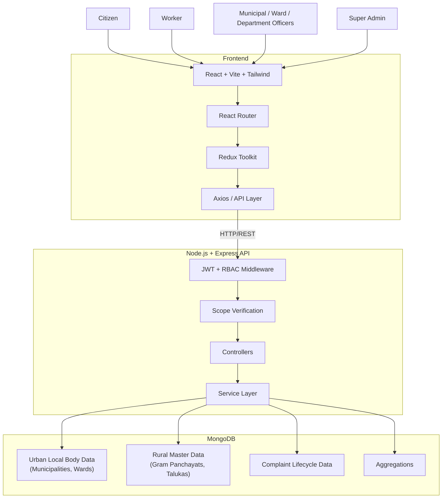
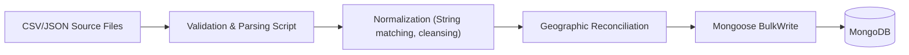
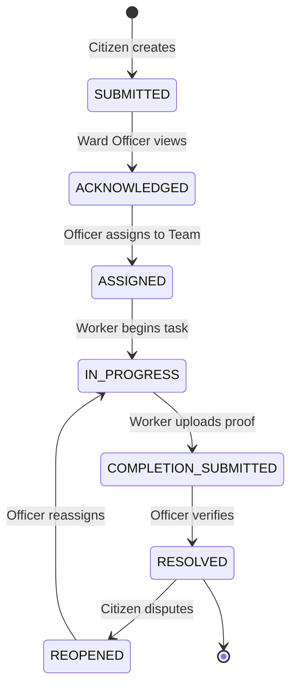
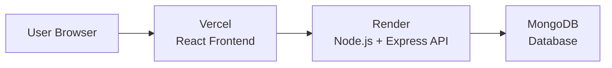

# Smart Municipal Management Platform

> A role-based digital platform for municipal complaint management, workforce coordination, SLA monitoring, analytics, and Maharashtra administrative/local-body management.

## Live Demo

| Component | Platform | URL |
| :--- | :--- | :--- |
| Frontend | Vercel | TBD — add deployed Vercel URL |
| Backend API | Render | TBD — add deployed Render URL |
| Database | MongoDB | Configured via environment variables — URL intentionally not published |

---

## Documentation Status
This README documents the current implementation state of the Smart Municipal Management Platform. It is intentionally maintained as a living document and will be updated as additional modules, deployments, integrations, testing, and production hardening are completed.

- **Current documentation version**: v1.0
- **Current project stage**: Phase 13 Complete (Post-Reconciliation Integrity Audit)

---

## Table of Contents

- [Executive Project Overview](#executive-project-overview)
- [Problem Statement & Solution](#problem-statement--solution)
- [Key Features](#key-features)
- [User Roles & RBAC Architecture](#user-roles--rbac-architecture)
- [System Architecture](#system-architecture)
- [Tech Stack](#tech-stack)
- [Database Architecture](#database-architecture)
- [Urban vs Rural Architecture](#urban-vs-rural-architecture)
- [Maharashtra Administrative Geography](#maharashtra-administrative-geography)
- [Local Government Data Sources](#local-government-data-sources)
- [Data Ingestion Architecture & LGD Codes](#data-ingestion-architecture--lgd-codes)
- [Gram Panchayat Reconciliation](#gram-panchayat-reconciliation)
- [Complaint Lifecycle & SLA Architecture](#complaint-lifecycle--sla-architecture)
- [Analytics & Dashboards](#analytics--dashboards)
- [API Documentation](#api-documentation)
- [Security Architecture & Testing](#security-architecture--testing)
- [Local Development Setup](#local-development-setup)
- [Deployment Guide](#deployment-guide)
- [Project Directory Structure](#project-directory-structure)
- [Development Phases & Status](#development-phases--status)
- [Performance & Data Integrity](#performance--data-integrity)
- [Known Limitations & Future Enhancements](#known-limitations--future-enhancements)
- [Security Notice & Disclaimers](#security-notice--disclaimers)

---

## Executive Project Overview

The **Smart Municipal Management Platform** is a scalable, modern MERN-stack application designed to address the complex logistical and operational challenges faced by municipal bodies in India. It serves as a unified digital ecosystem connecting citizens, field workers, municipal administrators, and state-level oversight authorities.

By centralizing the complaint lifecycle, the platform allows **Citizens** to intuitively report and track civic issues, while enabling **Ward and Department Officers** to seamlessly assign, monitor, and enforce Service Level Agreements (SLAs) for these reports. **Field Workers** utilize a dedicated interface to execute tasks, upload evidence, and mark resolutions.

Crucially, the platform manages the intricate geographic hierarchy of Maharashtra, supporting both **Urban Local Bodies** (Municipal Corporations, Councils, Nagar Panchayats) and **Rural Local Bodies** (Gram Panchayats) across Divisions, Districts, and Talukas. To maintain data integrity and strict access control, rural and urban management are cleanly segregated architecturally, ensuring that local administrators only access operations within their jurisdiction while providing **Super Admins** with a statewide master-data oversight view.

---

## Problem Statement & Solution

### Problem Statement

Managing municipal operations across a vast state like Maharashtra is fraught with operational bottlenecks. Civic complaints are often fragmented across multiple disjointed systems or manual paper trails, leading to unclear ownership and delayed resolutions. There is poor visibility into field worker activities, making workload balancing difficult. Furthermore, the state's geographic complexity—spanning varying tiers of urban municipalities and over 28,000 rural Gram Panchayats—presents a severe master-data management challenge, often resulting in unauthorized cross-jurisdiction access or rural/urban data contamination.

### Proposed Solution

| Problem | Platform Solution |
| :--- | :--- |
| **Complaint fragmentation** | Centralized complaint workflow from submission to resolution. |
| **Manual assignment** | Role-based assignment workflow to designated teams/workers. |
| **SLA uncertainty** | SLA tracking and automated due-date monitoring. |
| **Poor visibility** | Dedicated, role-specific dashboards and geographic analytics. |
| **Geographic complexity** | Tiered implementation of the Maharashtra administrative hierarchy. |
| **Rural/urban mixing** | Separate rural and urban local-body architecture and schema designs. |
| **Unauthorized access** | JWT + rigorous RBAC + jurisdictional scope middleware controls. |

---

## Key Features

- **Citizen Workflows**: Secure complaint submission, status tracking, visual timeline tracking, and categorized reporting.
- **Worker/Field Workflows**: Dedicated dashboards for assigned tasks, active task tracking, evidence uploads, and status updates.
- **Ward & Department Officer Tooling**: Ward-level and department-level complaint monitoring, workload balancing, team assignment, and SLA tracking.
- **Municipal Admin Suite**: Municipality-wide overview, multi-department workload monitoring, and escalated complaint tracking.
- **Super Admin Global Controls**: Statewide geographic master data management, Local Government Directory (LGD) synchronization, mass-user management, and global analytics.
- **Paginated Master Data**: Highly optimized, server-side paginated interfaces capable of securely rendering and filtering 28,000+ local bodies in milliseconds without browser memory exhaustion.

---

## User Roles & RBAC Architecture

### User Roles

| Role | Scope | Main Responsibilities |
| :--- | :--- | :--- |
| **CITIZEN** | Personal | Report and track personal complaints. |
| **WORKER** | Assigned work | Execute field tasks, upload evidence, complete assignments. |
| **INSPECTOR** | Assigned geography | Inspect and verify completed civic work. |
| **WARD_OFFICER** | Municipality + Ward | Monitor ward complaints, manage ward field teams, enforce SLAs. |
| **DEPARTMENT_OFFICER** | Municipality + Department | Monitor department complaints, manage department workload. |
| **MUNICIPAL_ADMIN** | Municipality | Oversee municipality, manage officers, track aggregate analytics. |
| **SUPER_ADMIN** | Global / Statewide | Manage divisions, districts, talukas, Gram Panchayats, global users. |

### RBAC Architecture

Authentication and authorization are driven by a robust **JWT** (JSON Web Token) implementation. 
The backend enforces security using stacked middleware:
1. `auth.middleware.js`: Verifies JWT validity and extracts the user payload.
2. `role.middleware.js`: Ensures the user possesses the required hierarchical role (e.g., `SUPER_ADMIN`).
3. `scope.middleware.js`: Prevents IDOR (Insecure Direct Object Reference) by ensuring a `MUNICIPAL_ADMIN` or `WARD_OFFICER` can only query, update, or assign resources that belong to their explicitly assigned `municipalityId` or `wardId`.

**IMPORTANT**: Gram Panchayat master data management is restricted strictly to `SUPER_ADMIN`. A `MUNICIPAL_ADMIN` manages Urban operations and absolutely must not have statewide rural access.

---

## System Architecture



### System Architecture Explanation
- **Client**: Built with React and Vite for blazing-fast HMR and optimized production builds. 
- **Routing**: `react-router-dom` drives SPA navigation, wrapped in declarative `ProtectedRoute` and `RoleRoute` components.
- **State Management**: Redux Toolkit manages global states, specifically UI toggles, authentication sessions, and cached analytics.
- **API Communication**: Configured `axios` instances with automatic token interception handle backend communication.
- **Authentication & Authorization**: Handled securely via HTTP headers, parsed by Express middleware, and decoded into actionable user scopes.
- **Controllers & Services**: Separation of concerns is maintained; Controllers parse requests and handle HTTP responses, while Services encapsulate complex business logic (e.g., geographic mapping, SLA calculation).
- **Database**: MongoDB serves as the persistent, document-oriented datastore, heavily utilizing Mongoose schemas for validation and relational population.

---

## Tech Stack

| Layer | Technology | Purpose |
| :--- | :--- | :--- |
| **Frontend** | React | Component-based UI library |
| **Build** | Vite | Ultra-fast frontend build tooling |
| **Styling** | Tailwind CSS | Utility-first CSS styling |
| **Routing** | React Router | Declarative SPA navigation |
| **State** | Redux Toolkit | Predictable application state |
| **HTTP** | Axios | Promise-based API communication |
| **Charts** | Recharts | Composable analytics visualization |
| **Backend** | Node.js | Asynchronous JavaScript runtime |
| **API** | Express.js | Minimalist REST API framework |
| **Database** | MongoDB | Persistent document storage |
| **ODM** | Mongoose | Data modeling and schema validation |
| **Authentication**| JWT | Stateless user authentication |
| **Security** | bcryptjs | Secure password hashing |

---

## Database Architecture

The data architecture relies on distinct collections mapped via robust Mongoose schemas:

| Model | Purpose |
| :--- | :--- |
| **User** | Authentication credentials and core identity. |
| **Profile** | Extended demographic and contact information. |
| **Municipality** | Urban local bodies (Corporations, Councils, Nagar Panchayats). |
| **Ward** | Administrative subdivisions within a Municipality. |
| **Area** | Hyper-local geographic markers within Wards. |
| **Department** | Operational municipal departments (e.g., Solid Waste, Water). |
| **Designation** | Standardized employee job titles. |
| **Employee** | Employment records linked to a User and Department. |
| **WorkerTeam** | Grouping of field workers for task assignment. |
| **Complaint** | Core complaint details, SLA, and current status. |
| **ComplaintUpdate**| Immutable ledger of complaint status transitions. |
| **ComplaintEvidence**| File references for completion or reporting proofs. |
| **Division** | Top-level Maharashtra administrative geography. |
| **District** | Sub-divisions within Divisions. |
| **Taluka** | Rural sub-districts within Districts. |
| **GramPanchayat** | Rural local-body master data. |

---

## Urban vs Rural Architecture

To prevent data contamination and enforce strict jurisdictional boundaries, the system explicitly separates Urban and Rural architecture.

**Urban Architecture (Operational)**
`State` → `District` → **`Municipality`** → `Ward` → `Area`
Municipalities contain their own Wards, Departments, and active operational Complaint workflows. A `MUNICIPAL_ADMIN` is scoped entirely to their `Municipality` document.

**Rural Architecture (Master Data)**
`State` → `Division` → `District` → **`Taluka`** → **`Gram Panchayat`**
Gram Panchayats are tracked as statewide master data. They are structurally distinct from Municipalities. There is no generic "LocalBody" model conflating a massive Municipal Corporation with a tiny Gram Panchayat, ensuring optimized indexing and distinct API security boundaries.

---

## Maharashtra Administrative Geography

The platform implements a highly accurate geographic hierarchy for the State of Maharashtra:
- **6 Divisions** (e.g., Konkan, Pune, Nashik)
- **36 Districts** 
- **350+ Talukas**
- **395 Urban Municipalities**
- **28,087 Gram Panchayats** (Rural Local Bodies)

*Note: The exact counts of rural local bodies are sourced directly from external integration scripts and represent the imported state of the system.*

---

## Local Government Data Sources

### Data Sources & References
- **Government Open Data Platform India**: [https://www.data.gov.in/](https://www.data.gov.in/)
- **Local Government Directory — Government of India**: [https://lgdirectory.gov.in/welcome.do](https://lgdirectory.gov.in/welcome.do)

**Data Source Disclaimer**:
LGD is used strictly as a reference for standardized local-government/geographic master data (e.g., LGD codes). The official LGD website describes LGD as a unified directory covering states, rural, and urban local governments, with LGD codes utilized as standard location identifiers for e-governance interoperability. 
*The Smart Municipal Management Platform utilizes this open data for geographic accuracy but is not an official LGD integration partner, nor does it claim official government ownership.*

---

## Data Ingestion Architecture & LGD Codes

### Data Ingestion Architecture



Data imports leverage Node.js streams (`csv-parser`) and MongoDB `bulkWrite` for high-performance idempotent upserts, preventing duplication on repeated script executions.

### LGD Code Architecture
- **Official LGD Code**: The external identifier assigned by the Government of India. Stored as `lgdCode` (String).
- **Internal ID**: The standard MongoDB `_id` (ObjectId) used for internal relational mapping.
LGD codes are heavily utilized for integrations and external referencing, while internal ObjectIds govern strict relational integrity, ensuring that application logic does not break if a government LGD code is restructured.

---

## Gram Panchayat Reconciliation

The integration of 28,087 rural Gram Panchayats required complex mapping to internal `talukaId` structures. A deterministic, multi-pass reconciliation script was utilized.

**Execution History (Verified):**
- 3974 initially unresolved
- Pass 1: 180 mapped → 3794 remaining
- Pass 2: 1766 mapped → 2028 remaining
- Pass 3: 1575 mapped → 453 remaining
- Pass 4: 453 mapped → 0 remaining
- **Total: 3974 successfully processed.**

The reconciliation script successfully resolved the previously unresolved Taluka references. A subsequent rigorous Phase 13 Integrity Audit validated the geographic consistency and completely purged BSON-type indexing duplicates, guaranteeing a 100% clean rural dataset.

---

## Complaint Lifecycle & SLA Architecture

### Complaint Lifecycle



### SLA Architecture
The platform enforces strict Service Level Agreements (SLAs) to guarantee timely civic resolutions.
SLAs track:
- Acknowledgment deadlines
- Resolution due dates
- Overdue flags
- Escalation paths

*Disclaimer: These SLA targets are application-defined configuration values used for workflow enforcement and should not be interpreted as official government SLA standards.*

---

## Analytics & Dashboards

### Role-Specific Dashboards
The platform dynamically serves completely distinct React dashboards based on the JWT payload:
- **Super Admin Dashboard**: Statewide local body metrics, global user adoption, and system health.
- **Municipal Admin Dashboard**: High-level municipality workload, ward comparisons, and SLA compliance.
- **Department Officer Dashboard**: Department-specific complaint trends, category breakdowns, and worker capacity.
- **Ward Officer Dashboard**: Ward-level active mapping, critical overdue tasks, and field team deployment.
- **Worker Dashboard**: Mobile-optimized active task list, evidence upload forms, and route requirements.
- **Citizen Dashboard**: Personal complaint history, visual timeline tracking, and reporting interfaces.

### Analytics API
| Endpoint | Purpose | Scope |
| :--- | :--- | :--- |
| `/api/analytics/ward-overview` | Ward-level SLA and category breakdown | `WARD_OFFICER` |
| `/api/analytics/municipality-overview`| Municipality SLA trends and ward comparisons | `MUNICIPAL_ADMIN` |
| `/api/analytics/global-overview` | Statewide adoption and infrastructure metrics | `SUPER_ADMIN` |

---

## API Documentation

The backend REST API is structurally grouped by domain. 

### Selected Endpoints
| Method | Endpoint | Purpose | Scope |
| :--- | :--- | :--- | :--- |
| `POST` | `/api/auth/login` | Authenticate user | Public |
| `GET` | `/api/municipalities` | List all municipalities | Public |
| `GET` | `/api/complaints/my` | Get citizen complaints | `CITIZEN` |
| `PATCH`| `/api/complaints/:id/assign` | Assign worker team | `WARD_OFFICER`, `DEPT_OFFICER` |
| `GET` | `/api/gram-panchayats` | Paginated rural lookup | `SUPER_ADMIN` |

### API Pagination
The Gram Panchayat endpoint (`/api/gram-panchayats`) handles 28,000+ records using strict **server-side pagination**.
- Supported queries: `page`, `limit`, `districtId`, `talukaId`, `search` (name), `lgdCode`.
- A hard maximum limit (e.g., 100) is enforced by the backend to prevent malicious pagination abuse or memory exhaustion.

---

## Security Architecture & Testing

### Security Architecture
- **Authentication**: JWT tokens issued securely on login.
- **Password Security**: Credentials hashed using `bcryptjs` with high salt rounds.
- **Scope-Based Authorization**: Users cannot access IDs outside their jurisdictional scope, rigorously preventing IDOR.
- **Mass-Assignment Protection**: Update controllers explicitly destructure only allowed fields (e.g., status, comments), preventing malicious injection of `role` or `municipalityId`.
- **Pagination Abuse Protection**: Hard limits on query constraints.
- **Dependency-Safe Deletion**: Deleting structural nodes (like a Ward) is blocked if dependent records (Complaints, Teams) exist.

### Security Testing
*Phase 12 Verification Results (Executed)*:
| Test | Result |
| :--- | :--- |
| Anonymous Gram Panchayat GET | **PASS — 401 Unauthorized** |
| Citizen access to GP | **PASS — 403 Forbidden** |
| Municipal Admin access to GP | **PASS — 403 Forbidden** |
| Super Admin access to GP | **PASS — 200 OK** |
| Pagination abuse (Limit > 100) | **PASS — Truncated to 100** |
| Mass assignment (Role injection) | **PASS — Blocked** |

---

## Environment Variables

The system relies on securely configured `.env` files. 
*Note: Do not expose actual secrets in source control.*

```env
PORT=5000
NODE_ENV=development
MONGODB_URI=<your-mongodb-connection-string>
CLIENT_URL=<your-frontend-url>
JWT_SECRET=<your-jwt-secret>
JWT_EXPIRES_IN=1d
```

---

## Local Development Setup

### Prerequisites
- Node.js (v22+)
- npm
- Git
- MongoDB connection string (configured via `.env`)

### Setup Instructions
1. **Clone Repository**
   ```bash
   git clone <repository-url>
   cd "Smart Municipal Management Platform"
   ```
2. **Install Dependencies**
   ```bash
   npm run install:all
   ```
3. **Configure Environment Variables**
   Duplicate `server/.env.example` to `server/.env` and supply your database URL and JWT secret.
4. **Start Application (Concurrent)**
   ```bash
   npm run dev
   ```

---

## Deployment Guide

### Deployment Architecture


### Frontend — Vercel
1. Create a new Vercel project and connect the repository.
2. Set Root Directory to `client`.
3. Build Command: `npm run build`
4. Output Directory: `dist`
5. Configure Environment Variables: `VITE_API_URL` pointing to the Render backend.
6. Deploy and verify.

### Backend — Render
1. Create a new Render Web Service connected to the repository.
2. Set Root Directory to `server`.
3. Build Command: `npm install`
4. Start Command: `npm start`
5. Add Environment Variables: `MONGODB_URI`, `JWT_SECRET`, `CLIENT_URL` (pointing to Vercel).
6. Deploy and verify the `/api/health` endpoint.

---

## Project Directory Structure

```text
Smart Municipal Management Platform/
├── client/
│   ├── src/
│   │   ├── components/
│   │   ├── pages/
│   │   ├── services/
│   │   ├── store/
│   │   ├── routes/
│   │   └── utils/
│   ├── package.json
│   └── vite.config.js
├── server/
│   ├── src/
│   │   ├── config/
│   │   ├── constants/
│   │   ├── controllers/
│   │   ├── data/
│   │   ├── middlewares/
│   │   ├── models/
│   │   ├── routes/
│   │   ├── scripts/
│   │   ├── services/
│   │   └── utils/
│   ├── package.json
│   └── .env.example
├── package.json
└── README.md
```

---

## Development Phases & Status

The platform is built iteratively.
1. Architecture audit & local-body type standardization.
2. District master and municipality master data generation.
3. RBAC, scope implementation, dependency safety.
4. Complaint lifecycle and SLA integrations.
5. Role-specific dashboards and analytics.
6. Maharashtra geographic hierarchy (Divisions, Districts, Talukas).
7. Gram Panchayat LGD integration and server-side pagination.
8. Security hardening & mass-assignment protection.
9. Taluka geographic reconciliation & Integrity Audit (Phase 13).

### Current Project Status
| Area | Status |
| :--- | :--- |
| Authentication | Implemented / Verified |
| RBAC | Implemented / Verified |
| Urban Geography | Implemented / Verified |
| Rural Geography | Implemented / Verified |
| Complaint Lifecycle | Implemented / Verified |
| SLAs | Implemented / Verified |
| Dashboards | Implemented / Verified |
| Gram Panchayat Integration| Implemented / Verified |
| Deployment | Configuration prepared / Live pending |

---

## Performance & Data Integrity

- **Performance**: High-volume datasets (like Gram Panchayats) utilize server-side filtering, `.limit()`, and `.skip()` to prevent memory exhaustion. Database queries rely heavily on Mongoose indexing.
- **Data Integrity**: Enforced through unique indexes (e.g., LGD codes), deterministic UUIDs, and strict dependency-aware deletion middleware that prevents orphaned relational documents. *Phase 13 successfully eliminated a multi-thousand BSON-type unique constraint duplication, proving the efficacy of internal audit tooling.*

---

## Known Limitations & Future Enhancements

### Known Limitations
- Deployment URLs are currently pending final production hosting.
- Formal performance benchmarking under heavy concurrent simulation has not yet been established.

### Future Enhancements
- Automated SMS/Email integration for citizen complaint updates.
- PWA/Mobile app packaging for offline Field Worker capabilities.
- Advanced predictive analytics for municipal resource allocation.
- Geospatial (GIS) map integrations for visual complaint hot-spotting.

---

## Security Notice & Disclaimers

### Security Notice
**Never commit production secrets.** `.env`, MongoDB credentials, JWT secrets, and API keys must be provided exclusively through deployment environment variables. The database URL should never be published publicly.

### Contribution Guidelines
- Preserve the existing MVC architecture.
- Maintain the strict separation of Urban and Rural structural models.
- Validate backend authorization middleware carefully on new routes.
- Test regressions before committing.

### Data Source Disclaimer
`data.gov.in` and LGD are utilized as external reference sources. The imported data represents a project snapshot. This platform does not claim official government ownership, and source attribution must remain visible. Future imports should preserve source provenance.

### License
License: Not yet specified.

### Acknowledgements
- Designed as an academic/placement-oriented full-stack software engineering platform.
- Data references courtesy of the Government Open Data Platform and Local Government Directory.
