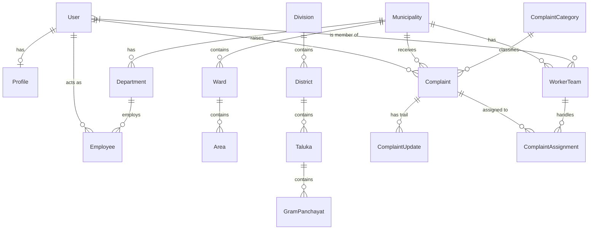

# Database Architecture

The Smart Municipal Management Platform uses **MongoDB** as its primary data store, with **Mongoose** acting as the Object Data Modeling (ODM) layer. The database schema is carefully designed to accommodate the complex administrative structures of Maharashtra while ensuring high performance, referential integrity (via constraints and LGD mapping), and secure role-based access control (RBAC).

## 1. Geographic & Administrative Hierarchy

One of the platform's core architectural decisions is the strict segregation of Urban and Rural local bodies, aligning with Indian administrative structures. Both hierarchies rely heavily on **Local Government Directory (LGD) Codes** for absolute deterministic integrity.

### 1.1 Urban Local Bodies (ULBs)
Urban management focuses on municipalities and their internal sub-divisions.
- **`Municipality`**: Represents Municipal Corporations (Mahanagarpalika), Municipal Councils (Nagar Parishad), and Nagar Panchayats. 
  - Contains `lgdCode`, `name`, `type`, `district`, and demographic data.
- **`Ward`**: A sub-division within a Municipality. Used heavily for RBAC scope isolation (e.g., `Ward Officer` access).
  - Contains `municipalityId` (ref: Municipality), `wardNumber`, `name`.
- **`Area`**: A specific locality within a Ward, used for pinpointing complaints.

### 1.2 Rural Local Bodies (RLBs)
Rural management follows the standard cascading state administrative structure.
- **`Division`**: Administrative division (e.g., Pune Division, Konkan Division).
- **`District`**: Zilla Parishad level. Contains `divisionId`.
- **`Taluka`**: Panchayat Samiti level (Block/Tehsil). Contains `districtId`.
- **`GramPanchayat`**: The village-level local body. Contains `talukaId`, `districtId`, `lgdCode`, `villageName`.
  - *Note: Gram Panchayat endpoints are heavily restricted and segregated from urban endpoints.*

---

## 2. Identity & Access Management (IAM)

- **`User`**: The central authentication model. Handles credentials, JWT token generation, password hashing (bcrypt), and account status.
  - Fields: `email`, `password`, `role` (enum: SUPER_ADMIN, MUNICIPAL_ADMIN, WARD_OFFICER, CITIZEN, etc.), `isActive`.
  - *Security*: Passwords are never returned in queries (`select: false`).
- **`Profile`**: Extended user details linked 1-to-1 with `User`. Stores demographic information, address, and profile pictures.

---

## 3. Organizational Structure & Workforce

Municipalities manage their own workforce, departments, and teams.
- **`Department`**: e.g., Water Supply, Solid Waste Management. Linked to a `Municipality`.
- **`Designation`**: Titles for employees within departments.
- **`Employee`**: Links a `User` to a `Municipality`, `Department`, and `Designation`. Allows tracking of staff across the platform.
- **`WorkerTeam`**: Field operation units. Contains a `supervisor` (User) and an array of `members` (Users). Assigned to specific `Wards` and `Municipalities`.

---

## 4. Complaint & Grievance Management System

The core operational feature of the platform. The schema design allows for deep tracking of SLA breaches, updates, and assignments.

- **`Complaint`**: The primary entity.
  - **References**: `citizen` (User), `municipalityId`, `wardId`, `categoryId`.
  - **Data**: `description`, `location` (GeoJSON Point), `status` (OPEN, ASSIGNED, IN_PROGRESS, RESOLVED, CLOSED, REJECTED), `priority`.
  - **SLA**: Tracks `slaDeadline` and `isSlaBreached`.
- **`ComplaintCategory`**: Defines complaint types (e.g., "Potholes"), expected SLA resolution times (in hours), and assigned departments.
- **`ComplaintAssignment`**: Tracks which `WorkerTeam` or `User` is currently assigned to resolve the complaint.
- **`ComplaintUpdate` / `ComplaintComment`**: Audit trail entities. Tracks every status change, internal note, or public comment made on a complaint.
- **`ComplaintEvidence`**: Stores pre-resolution and post-resolution photos/documents (e.g., Cloudinary URLs) linked to the complaint.

---

## 5. Entity-Relationship Diagram (Simplified)

---

## 6. Local Government Directory (LGD) Integration

To prevent data duplication and ensure mapping accuracy across Maharashtra's 36 districts, 350+ Talukas, and 28,000+ Gram Panchayats, the platform strictly enforces unique constraints on the `lgdCode` field (Int32 BSON type).
- **Idempotent Imports**: Seed scripts utilize `updateOne` with `upsert: true` matching on `lgdCode` to ensure database updates are safely repeatable without duplication.
- **Cross-Platform Sync**: By using standard LGD codes, the platform's data can cross-reference with official Government of India datasets.

---

## 7. Indexing and Performance Optimization

To handle potentially millions of complaint records and thousands of concurrent users, the database utilizes strategic indexing:
- **Geo-Spatial Indexes**: `2dsphere` indexes on `Complaint.location` for proximity-based querying (e.g., "find complaints within 5km").
- **Compound Indexes**: Commonly queried fields are combined. For example, `{ municipalityId: 1, status: 1 }` on the `Complaint` collection powers the municipal dashboards efficiently.
- **Unique Indexes**: Applied to `email` (Users) and `lgdCode` (Municipalities, Gram Panchayats) to enforce data integrity at the database level.
- **Pagination**: All list endpoints utilize cursor-based or `skip`/`limit` pagination to prevent memory overflow on large datasets.
